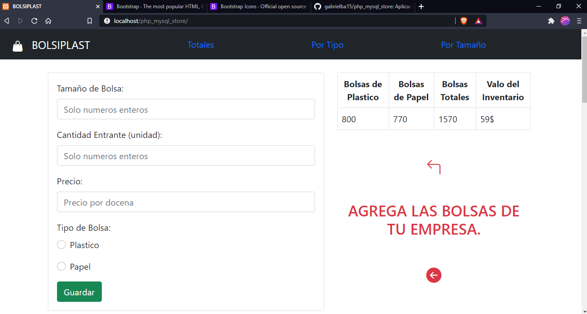
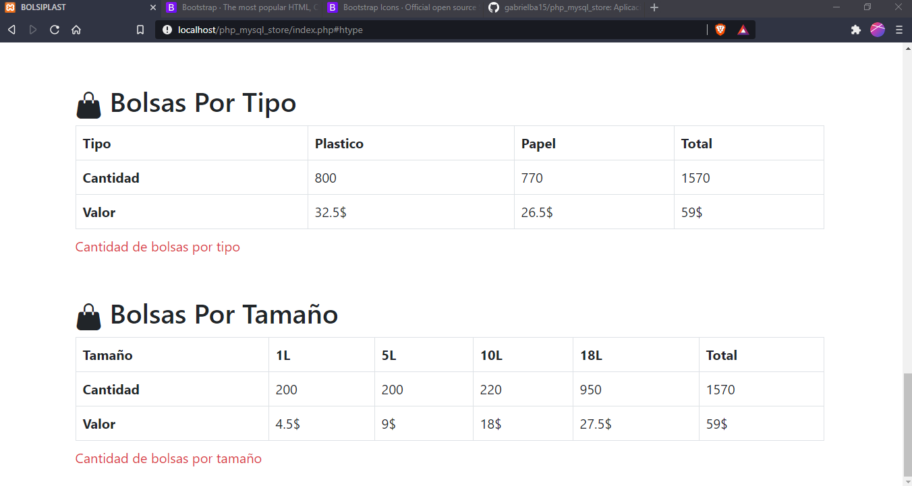
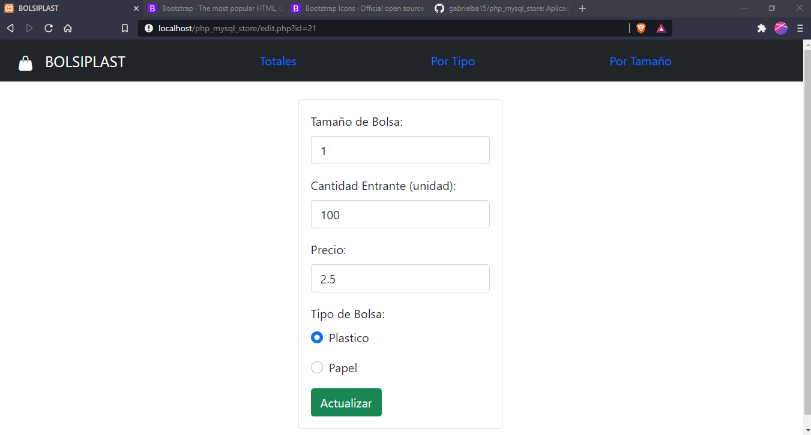

# PHP Y MYSQL INVENTARIO DE BOLSAS
Aplicacion creada a partir de una asignacion de la materia Laboratorio de Datos de la universidad.
# Asignación/Problema 
Realice un formulario que permita llevar el inventario de una empresa distribuidora de bolsas de papel y plástico.

Se debe alimentar con los siguientes datos:
- Tipo de Bolsa. PLÁSTICO - PAPEL.
- Tamaño de la Bolsa. En Litros.
- Cantidad Entrante. POR UNIDAD.
- Precio por docena.

Se debe generar un reporte que muestre:

- Cantidad de Bolsas totales.
- Cantidad de bolsas por tipo. 
- Cantidad de bolsas por tamaño.
- Valor total del inventario.
# Página principal

# Página secundaria

# Página para editar

# Requerimientos
- [xampp](https://www.apachefriends.org/es/download.html#)
- [git](https://git-scm.com)

# Usage
En el archivo includes/config.php esta la configuracion de las variables globales, puedes editarlo con la configuracion de tu sistema.

Puedes cambiar los siguientes valores:

1. El puerto de la instancia de mysql
2. Usuario de mysql
3. Clave del usuario

### Ejemplo
~~~
$host = 'localhost:8111';    
$usuario = 'root';           
$clave = '';
~~~

En la carpeta database estan los scripts para la creación de las bases de datos sql. 
Solo tienes que insertar el archivo sql en el manejador de base de datos de tu preferencia para crear la base de datos.
Para tener la app activa solo tienes que agregar el carpeta del proyecto a la carpeta de xampp llamada htdocs e ir a [localhost/php_mysql_store](https://github.com/gabrielba15/php_mysql_store/blob/master/README.md#Usage)

# Para tener activa la app
1. Clonar repositorio con git, GitHub CLI o descargar la carpeta comprimida.
~~~ 
# cmd 
~~~
~~~
 cd %USERPROFILE%\Desktop 
~~~ 
~~~
git clone https://github.com/gabrielba15/php_mysql_store.git 
~~~ 
2. Mover o copiar la carpeta clonada a la carpeta htdocs de xampp
3. Crea la base de datos si no la haz creado aun (php_mysql_contacts.sql).
4. Cambia los valores de config.php
5. Ve a localhost/php_mysql_store en tu navegador.
6. Listo, happy hacking crack :D
